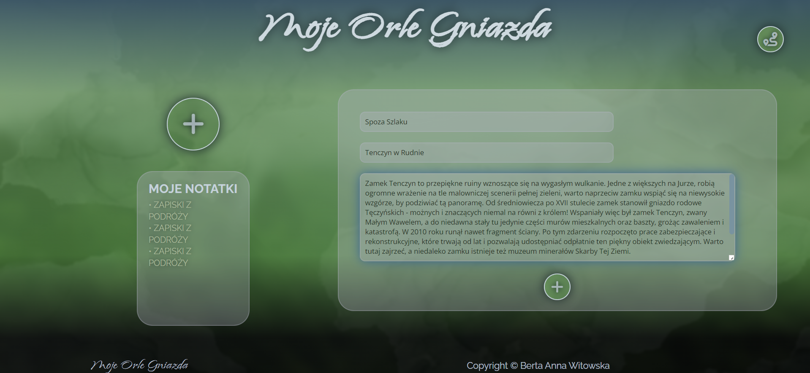

# Moje-Orle-Gniazda

**Final project from the JavaScript Developer course**

## MOJE ORLE GNIAZDA (My Eagles' Nests)

It is a project of a simple webb app that provides basic information about the region of Jura Krakowsko-Częstochowska, the Trail of Eagles' Nests, and selected places on the trail.
You can also view the photo gallery here, and - after logging in, add selected items to the list of places you would like to visit, and add your travel notes in the "My notes" section.

## 

## Deployment

#### Project is now live at _Netlify_

```https
// Link do projektu
```

---

### Install:

Project build based on Vite.
creating vite project

```bash
npm create vite@latest moje-orle-gniazda --template react
```

To run this project, install it locally using npm:

### installation

```bash
npm install
```

### SASS

```bash
npm install -D sass
```

### emailJS

https://www.emailjs.com/

```bash
npm i emailjs-com
```

### supabase

https://app.supabase.com/projects

```bash
npm i @supabase/supabase-js
```

### React router

```bash
npm install --save react-router-dom
```

### Toasters and tooltips

https://evergreen.segment.com/

```bash
npm install evergreen-ui
```

---

# PROJECT DESCRIPTION

---

## _Signing in & registration_

## 

#### Code snippet - **SignIn**

```javascript
const loginUser = async (e) => {
  e.preventDefault();

  const [email, password] = e.target.elements;

  let {
    data: {user},
    error,
  } = await supabase.auth.signInWithPassword({
    email: email.value,
    password: password.value,
  });
  if (error) {
    toaster.warning("Pojawił się problem. Spróbuj jeszcze raz!");
    return;
  }
  toaster.success("Logowanie powiodło się!");
  navigate("/trailbaseview");
};
```

---

## _Contact form_

#### The possibility to send messages directly to the mailbox using emailJS, available to all users.

## 

---

## EmailJS Reference:

#### EmailJS API keys:

```http
  https://dashboard.emailjs.com/admin/account
```

| Parameter    | Type     | Description   |
| :----------- | :------- | :------------ |
| `Public key` | `string` | **Required**. |

| Parameter     | Type     | Description   |
| :------------ | :------- | :------------ |
| `Private key` | `string` | **Required**. |

#### EmailJS Service ID:

```http
https://dashboard.emailjs.com/admin
```

| Parameter    | Type     | Description   |
| :----------- | :------- | :------------ |
| `Service ID` | `string` | **Required**. |

---

#### Code snippet - **Contact**

```javascript
emailjs;
const form = useRef();

const sendEmail = (e) => {
  e.preventDefault();

  emailjs.sendForm(emailJS_serviceKEY, template, form.current, publicKEY).then(
    (result) => {
      toaster.success("Wiadomość wysłana!");
    },
    (error) => {
      toaster.danger("Wysyłanie nie powiodło się !");
    }
  );
  e.target.reset();
};
```

---

## _Trail view_

#### The whole trail prewiev, with the possibility to move to the description of a specific place on trail.

## 

---

## _Places on trail_

#### Descriptions, links & illustrations displayed by _map_ function.

## 

---

## _Notes from trips_

### Adding & fetching notes (Supabase).

## 

## SUPABASE API Reference

```http
  https://app.supabase.com/projects
```

| Parameter      | Type     | Description   |
| :------------- | :------- | :------------ |
| `Supabase url` | `string` | **Required**. |

| Parameter          | Type     | Description   |
| :----------------- | :------- | :------------ |
| `Supabase api key` | `string` | **Required**. |

---

#### Code snippet - **MyTripsAddNew**

```javascript
const addPost = async (e) => {
  e.preventDefault();

  const [title, localization, description] = e.target.elements;

  const {data, error} = await supabase.from("post").insert([
    {
      user_id: userId,
      title: title.value,
      localization: localization.value,
      description: description.value,
    },
  ]);
  if (error) {
    toaster.danger("Dodawanie nie powiodło się!");
  }
  toaster.success("Zmiany zostały zapisane!");
  e.target.reset();
};
```

## 

---

## Fonts and icons

- [Fontawesome](https://fontawesome.com/icons)

---

## To-do

- Adding the ability to edit notes.
- Adding weather forecast.

---

## License

Copyright [yyyy] [Berta Anna Witowska](https://www.apache.org/licenses/LICENSE-2.0)
